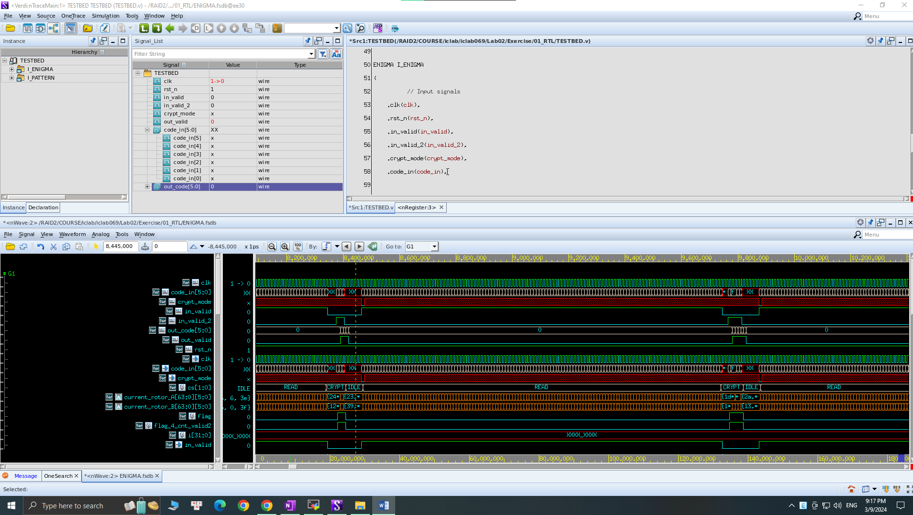
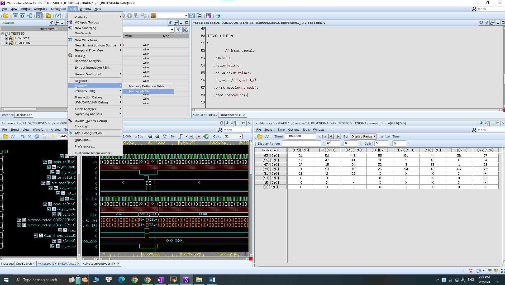
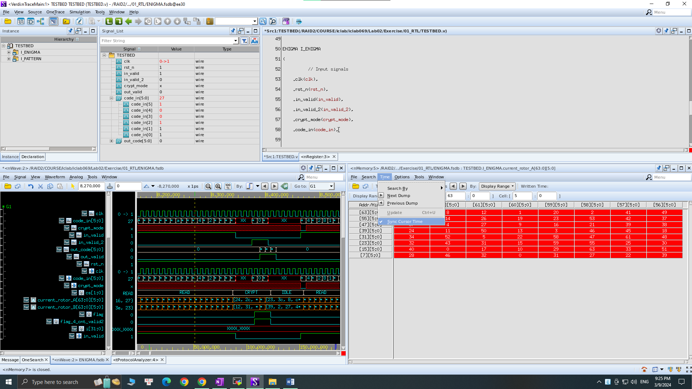
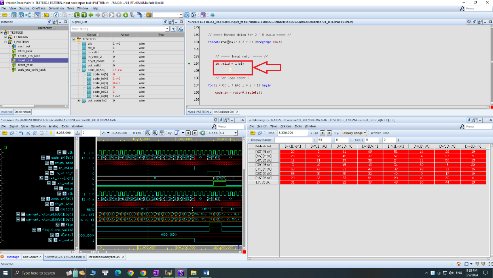

# [Course] IC Lab

:::info
:bulb: IC Lab Course from National Yang Ming Chiao Tung University - Taiwan
:::

---

## :beginner: This course is taken note by Duc Huy Nguyen who joined IC lab course in the Spring semester of 2024 from National Yang Ming Chiao Tung University - Taiwan

:::success
Describe the essential information of the design document.
:::

---

## :wrench: Knowledge-Based Requirements

:::success
- Digital IC Design 
- Verilog Coding 
- System Verilog Coding 
- Knowledge of algorithm
:::
Basic knowledge
onenote:https://d.docs.live.net/c14830083d8bce9a/Documents/Working%20-%20Company%20Requirements/Tech_Work_Knowledges_and_CodeBase.one#IC%20Design%20Knowledges%20&section-id={CC374C7C-DD50-43D1-A2C4-02D7777E041A}&page-id={CC4F8C6C-E323-42A2-AD42-3391617D064B}&object-id={60780FAF-20EE-0748-2074-F02C5FA7918C}&3E

---
## Overview for IC Design Flow


---
## :feet: Implementation

:::success
- Using EDA from TSRI, Taiwan and also provided by IC Lab Course.
- Process UMC18. 
:::

---

1. Example of · Sign in successfully 


# First Look of Tools  

## Verdi From Synopsys  

### First Look of Tools

#### • Verdi from Synopsys

#### ◦ Initial View  


#### ◦ Open Memory/MDA for More Detail  


#### ◦ Using “Sync” to See Real-Time Variable Values  
When clicking the “---” line on the waveform, “Sync” allows you to view the actual value of the variable at that moment.  
The position of the “---” line corresponds exactly to the variable’s representation in the Memory Table.  


#### ◦ Selecting Variables in the Code Tab  
You can select the variable directly in the coding tab to inspect its value.  


### § Synthesis Step  

There are two options in the **`.tcl`** file named **`syn.tcl`**:  

1. **`compile_ultra`**:  
   - Instructs the Synopsys tool to normalize the timing during synthesis.  
2. **`compile`**:  
   - Performs synthesis normally without any timing optimization.  

> ⚠️ **Important:**  
> Use only one of these options at a time. Do not use both together.  

---

### § Running RTL, SYN, or GATE Level  

- Pay attention to the **`TESTBED.v`** file.  
- The **`.fsdb`** file is used to store waveform data.  
  - The command **`$fsdbDumpvars();`** is used to dump variables following the waveform of the **`.fsdb`** file.  
- If waveform debugging is unnecessary, remove these two commands to save storage.  

> ⚠️ **Note:**  
> Do not delete the command **`$sdf_annotate("CNN_SYN.sdf", u_CNN);`**.  
> This command saves timing information (like delay) from RTL to GATE conversion, which is crucial.  

---

# Some Useful Command Lines  

## If some application is still running on your station in MobaXterm and you cannot close it:  
- Use the appropriate commands to terminate the application gracefully.  


```ps -aux | grep $user``` 

and then find the pid using CMD: ```kill -9 {pid}``` 

 - Example: 

``` bash 
ps -aux | grep iclab069

kill -9 152160
``` 

## Checking quota (**storage **limitation for each students)** 
----------------------------------------------------------------

CMD: ```quota``` 
OR 
CMD: ```quota -s```
=> be able to see the MB size => space is what we are occupation for while quota is the warning limitation, and Limit is the endpoint that your account is locked. 

```du  {name of folder} ```
=> check the size of each files for occupation 

```du -a  {name of folder}``` 
=> check MORE DETAIL the size of each files for occupation 

## Encrypt Verilog code:** 

```vcs +auto2protect PATTERN.v``` 

```vcs +auto2protect pseudo_DRAM.v```

## For Tools: 
### Super lint: 
Some of comments 

```tar xvf ~iclabTA01/jg_superlint.tar```

open => vim design.f => input MY_DESIGN.v

```./run_jp/superlint.sh```


## :blush: Demo
:::success
Some interesting script for ICLAB
:::

1.  **Display current quota percentage when logging in**  


2.  ****Quickly switch folders**  
Expand function description:  
- Input 0 swithc to `00_TESTBED`  
- Input 1 switch to `01_RTL`  
- Input 2 switch to `02_SYN`  
- Input 3 switch to `03_GATE`  
- Input 4 switch to `04_MEM`  
- Input 9 switch to `09_SUBMIT`  
- m `Memory`


3. Modify the clk peroid input **with one click**c to view the current `clk`setting  
    input modification and displayc peroid `clk`  
    

4.  **Turn on/off fsdb**  
Input with one click f. View current settings. Input `fsdb`modifications and display settings. Enter modifications and display settings. Enter modifications and display settings. 
    - For rtl on/off `rtl fsdb`   
    - For gate on/off `gate fsdb`   
    - For post on/off `post fsdb`   
    

5.  **Open DesignWare IP User Guide with one click**  
    . Input dwipto open DesignWare IP Pdf.  
    Input ioto open IO Pdf.  
    


Script content and setting method
======================================

0.  **Copy the instructions in the following steps directly. In MobaXterm, you can right-click the mouse to paste and execute.**
1.  Execute the following command to add a new script folder`script`
    ```bash
    cd $HOME
    mkdir script
    ```
2.  Execute the following commands to add `setting.csh`a script and set execution permissions
    ```bash
    cat > $HOME/script/setting.csh << EOF
    #!/bin/tcsh
    # Brief : This is a script to set variable for cd.csh, clk.csh, fsdb.csh
    # Author: Duc Huy Nguyen
    # Update: 2024.03.23
    
    set FOLDER="Lab05/Exercise"
    #set FOLDER="Bonus_formal_verification/Exercise"
    #set FOLDER="Final_Project"
    
    set TESTBED_FILE=\$HOME/\$FOLDER/00_TESTBED/TESTBED.v
    set PATTERN_FILE=\$HOME/\$FOLDER/00_TESTBED/PATTERN.v
    set SYN_FILE=\$HOME/\$FOLDER/02_SYN/syn.tcl
    
    # Define colors
    set GREEN='\033[0;32m'
    set BLUE='\033[0;34m'
    set RED='\033[0;31m'
    set NC='\033[0m' # No Color
    EOF
    
    chmod +x $HOME/script/setting.csh
    ```
    
3.  Execute the following commands to add `cd.csh`a script and set execution permissions
    ```bash
    cat > $HOME/script/cd.csh << EOF
    #!/bin/tcsh
    # Brief : This is a script to change directory
    # Author: Duc Huy Nguyen
    # Update: 2024.03.23
    
    # get the variable from setting.csh
    source \$HOME/script/setting.csh
    
    # check parameter
    if (\$# == 0) then
      echo "\${RED}Please input 0, 1, 2, 3, 4, 5, or 9\${NC}"
      exit 1
    else
      # cd to folder
      switch (\$1)
        case [0-9]:
          cd \$HOME/\$FOLDER/0\$1_*     || (echo "\${RED}Change directory fail\${NC}"; exit 1)
          breaksw
        case m:
          cd \$HOME/\$FOLDER/Memory   || (echo "\${RED}Change directory fail\${NC}"; exit 1)
          breaksw
        default:
          echo "\${RED}Please input 0, 1, 2, 3, 4, 5, or 9\${NC}"
          exit 1
          breaksw
      endsw
    
      # Check if cd was successful
      if (\$? == 0) then
        echo "\${GREEN}Current directory: \`pwd\`\${NC}"
      endif
    endif
    EOF
    
    chmod +x $HOME/script/cd.csh
    ```
    
4.  Execute the following commands to add `clk.csh`a script and set execution permissions
    ```bash
    cat > $HOME/script/clk.csh << EOF
    #!/bin/tcsh
    # Brief : This is a script to change the clock peroid define
    # Author: Duc Huy Nguyen
    # Update: 2024.02.20
    
    # get the variable from setting.csh
    source \$HOME/script/setting.csh
    
    # check parameter
    if (\$# == 0) then
      # testbed file
      echo \${BLUE}File: \$TESTBED_FILE\${NC}
      setenv GREP_COLOR '01;32' ; cat --number \$TESTBED_FILE | grep --color "define\s\+CYCLE_TIME\s\+[0-9]\+\.\?[0-9]\?"
      # pattern file
      echo \${BLUE}File: \$PATTERN_FILE\${NC}
      setenv GREP_COLOR '01;32' ; cat --number \$PATTERN_FILE | grep --color "define\s\+CYCLE_TIME\s\+[0-9]\+\.\?[0-9]\?"
      # syn file
      echo \${BLUE}File: \$SYN_FILE\${NC}
      setenv GREP_COLOR '01;32' ; cat --number \$SYN_FILE | grep --color "set CYCLE [0-9]\+\.\?[0-9]\?"
      exit 1
    else
      #if([string tofloat \$1] < 5.0) then
      #  echo "\${RED}Cycle time must >= 5. \${NC}"
      #else
        # testbed file
        echo \${BLUE}File: \$TESTBED_FILE\${NC}
        setenv GREP_COLOR '01;31' ; cat --number \$TESTBED_FILE | grep --color "define\s\+CYCLE_TIME\s\+[0-9]\+\.\?[0-9]\?"
        sed -i "s/define\s\+CYCLE_TIME\s\+[0-9]\+\.\?[0-9]\?/define CYCLE_TIME \$1/" \$TESTBED_FILE
        setenv GREP_COLOR '01;32' ; cat --number \$TESTBED_FILE | grep --color "define\s\+CYCLE_TIME\s\+[0-9]\+\.\?[0-9]\?"
        # pattern file
        echo \${BLUE}File: \$PATTERN_FILE\${NC}
        setenv GREP_COLOR '01;31' ; cat --number \$PATTERN_FILE | grep --color "define\s\+CYCLE_TIME\s\+[0-9]\+\.\?[0-9]\?"
        sed -i "s/define\s\+CYCLE_TIME\s\+[0-9]\+\.\?[0-9]\?/define CYCLE_TIME \$1/" \$PATTERN_FILE
        setenv GREP_COLOR '01;32' ; cat --number \$PATTERN_FILE | grep --color "define\s\+CYCLE_TIME\s\+[0-9]\+\.\?[0-9]\?"
        # syn file
        echo \${BLUE}File: \$SYN_FILE\${NC}
        setenv GREP_COLOR '01;31' ; cat --number \$SYN_FILE | grep --color "set CYCLE [0-9]\+\.\?[0-9]\?"
        sed -i "s/set CYCLE [0-9]\+\.\?[0-9]\?/set CYCLE \$1/" \$SYN_FILE
        setenv GREP_COLOR '01;32' ; cat --number \$SYN_FILE | grep --color "set CYCLE [0-9]\+\.\?[0-9]\?"
    
        # Check if cd was successful
        if (\$? == 0) then
          echo "\${GREEN}Change cycle time to \$1 dnoe. \${NC}"
        endif
      #endif
    
    endif
    EOF
    
    chmod +x $HOME/script/clk.csh
    ```
    
5.  Execute the following commands to add `fsdb.csh`a script and set execution permissions
    ```bash
    cat > $HOME/script/fsdb.csh << EOF
    #!/bin/tcsh
    # Brief : This is a script to open/close the FSDB
    # Author: Duc Huy Nguyen
    # Update: 2024.03.23
    
    # get the variable from setting.csh
    source \$HOME/script/setting.csh
    
    # check parameter
    if (\$# == 0) then
      set show = 1
      set help = 1
      goto conclusion
    else
      # check if file exit
      if (-e \$TESTBED_FILE) then
        #--------------------------------------------------------- section
        switch (\$1)
          case 'rtl':
            set section = 'RTL'
            breaksw
          case 'gate':
            set section = 'GATE'
            breaksw
          case 'post':
            set section = 'POST'
            breaksw
          default:
            set show = 0
            set help = 1
            goto conclusion
            breaksw
        endsw
      else
        echo "\$TESTBED_FILE not exist"
      endif
      #--------------------------------------------------------- FSDB ON/OFF
      if (\$2 == 'on') then
        # find and remove comment in ifdef RTL to endif
        sed -i "/ifdef \$section/,/endif/s/\/\/\(.sdf_annotate(.*);\)/\1/g" \$TESTBED_FILE
        sed -i "/ifdef \$section/,/endif/s/\/\/\(.fsdbDumpfile(.*);\)/\1/g" \$TESTBED_FILE
        sed -i "/ifdef \$section/,/endif/s/\/\/\(.fsdbDumpvars(.*);\)/\1/g" \$TESTBED_FILE
        echo "\${GREEN}Uncomment \${section} fsdbDumpfile, fsdbDumpvars done.\${NC}"
        set show = 1
        set help = 0
        goto conclusion
      else if (\$2 == 'off') then
        # check if file is commented
        if (\`awk 'BEGIN { s=0 } /.ifdef '\$section'/,/.endif/ { if (\$0 ~ /\/\/.*/) { s=1; exit } } END { print s}' \$TESTBED_FILE\` == "0") then
          #sed -i "/ifdef \$section/,/endif/s/\(.sdf_annotate(.*);\)/\/\/\1/g" \$TESTBED_FILE
          sed -i "/ifdef \$section/,/endif/s/\(.fsdbDumpfile(.*);\)/\/\/\1/g" \$TESTBED_FILE
          sed -i "/ifdef \$section/,/endif/s/\(.fsdbDumpvars(.*);\)/\/\/\1/g" \$TESTBED_FILE
        endif
        echo "\${GREEN}Comment \${section} sdf_annotate, fsdbDumpfile, fsdbDumpvars done.\${NC}"
        set show = 1
        set help = 0
        goto conclusion
      else
        set show = 0
        set help = 1
        goto conclusion
      endif
    
    endif
    
    conclusion:
    # show the state of fsdb file
    if (\$show == 1) then
      echo \${BLUE}File: \$TESTBED_FILE\${NC}
      echo \${GREEN}In RTL\${NC}
      awk '/.ifdef RTL/,/.endif/ {if (\$0 ~ /sdf_/) print}' \$TESTBED_FILE
      awk '/.ifdef RTL/,/.endif/ {if (\$0 ~ /fsdb/) print}' \$TESTBED_FILE
      echo \${GREEN}In GATE\${NC}
      awk '/.ifdef GATE/,/.endif/ {if (\$0 ~ /sdf_/) print}' \$TESTBED_FILE
      awk '/.ifdef GATE/,/.endif/ {if (\$0 ~ /fsdb/) print}' \$TESTBED_FILE
      echo \${GREEN}In POST\${NC}
      awk '/.ifdef POST/,/.endif/ {if (\$0 ~ /sdf_/) print}' \$TESTBED_FILE
      awk '/.ifdef POST/,/.endif/ {if (\$0 ~ /fsdb/) print}' \$TESTBED_FILE
    endif
    # show the usage of this script
    if(\$help == 1) then
      echo "\${RED}Please input {rtl, gate, post} {on, off} to turn on/off fsdb file.\${NC}"
    endif
    # exit
    exit 1
    EOF
    
    chmod +x $HOME/script/fsdb.csh
    ```
    
6.  Add new `.cshrc`profile
    ```bash
    cd $HOME
    cat > $HOME/.cshrc << EOF
    # .cshrc configuration file for iclab workstation
    # Author: Duc Huy Nguyen
    # Update: 2024.03.23
    
    # Show space usage
    source ~/script/quota.csh
    
    # set terminal preference
    set autolist = ambiguous 
    set complete = enhance
    set recexact
    set autoexpand
    
    # Hotkey
    alias 0       'source ~/script/cd.csh 0'
    alias 1       'source ~/script/cd.csh 1'
    alias 2       'source ~/script/cd.csh 2'
    alias 3       'source ~/script/cd.csh 3'
    alias 4       'source ~/script/cd.csh 4'
    alias 5       'source ~/script/cd.csh 5'
    alias 6       'source ~/script/cd.csh 6'
    alias 7       'source ~/script/cd.csh 7'
    alias 8       'source ~/script/cd.csh 8'
    alias 9       'source ~/script/cd.csh 9'
    alias m       'source ~/script/cd.csh m'
    alias c       'source ~/script/clk.csh'
    alias f       'source ~/script/fsdb.csh'
    alias rs      'source ~/.cshrc'
    alias setting 'code ~/script/setting.csh'
    alias dwip    'evince /usr/cad/synopsys/synthesis/cur/dw/doc/manuals/dwbb_userguide.pdf >& /dev/null &'
    alias io      'evince ~iclabTA01/umc018/Doc/umc18io3v5v.pdf >& /dev/null &'
    alias myps    'ps -aux | grep \$user'
    EOF
    
    source $HOME/.cshrc
    ```
    
7.  **If you want to modify the Lab path later**
-   Editing `~script/setting.csh`_`set FOLDER="Lab??/Exercise"`
-   Or enter it directly `setting`, and ![]the VSCode window will pop up and you can edit it.  


# Important Source Files for Digital IC Flow
1. Important for 00_TESTBED
- [Makefile](https://github.com/ndhuyvn1994/IC_Lab_NYCU_Year2024_iclab069/blob/main/Lab01/Lab01_FinalVersion_GoodToRun_and_Learn/Exercise/00_TESTBED/makefile)

2. Important for 02_SYN
- [TCL file for Synthesis](https://github.com/ndhuyvn1994/IC_Lab_NYCU_Year2024_iclab069/blob/main/Lab01/Lab01_FinalVersion_GoodToRun_and_Learn/Exercise/02_SYN/syn.tcl)


# Experimental Demo

1. Chip Layout View:  
     

2. Core to IO boundary:  
     

3. Core Ring:  
     

4. Post-Route setup time analysis:  
     

5. Post-Route hold time analysis:  
     

6. DRC result:  
     

7. LVS result:  
     

8. Post Layout simulation result:  
     

9. Power result:  
     

10. IR Drop Results:  
      

* A brief explanation of the method you used to mitigate the IR drop issue: 
    * The number of power pads was increased, ensuring there are two pairs of core power and IO power on each side of the design. 
    * The distribution of power across the circuitry was enhanced by adding more power pads. 
    * The width of the power strips was expanded to reduce resistance along the power path. 
    * The voltage drop was minimized by increasing the width of the power strips. 
    * Overall power delivery was improved by implementing wider power strips and additional power pads.# [Course] IC Lab
